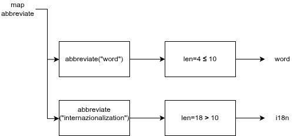

# Way Too Long Words - Evidence of a Programming Parafigm

## Functional Paradigm - Racket 

### 1. Description

Source: Codeforces 71A - Way Too Long Words

Sometimes some words like "localization" or "internationalization" are so long that writing them many times in one text is quite tiresome.

Let's consider a word too long, if its length is strictly more than 10 characters. All too long words should be replaced with a special abbreviation.

This abbreviation is made like this: we write down the first and the last letter of a word and between them we write the number of letters between the first and the last letters. That number is in decimal system and doesn't contain any leading zeroes.

Thus, "localization" will be spelt as "l10n", and "internationalization» will be spelt as "i18n".

You are suggested to automatize the process of changing the words with abbreviations. At that all too long words should be replaced by the abbreviation and the words that are not too long should not undergo any changes.


 All too-long words must be replaced with and abbreviation built in the following way:

``` 
firstletter + countofmiddleletters + lastletter
```

Words with 10 or fewer characters remain unchanged.

Example :

| input | output |
|-------|--------|
| word  | word   |
| internationalization | i18n |
| localization | l10n | 
| pneumonoultramicroscopicsilicovolcanoconiosis | p43s |

**Constraints:**

* 1 ≤ n ≤ 100 (number of words)

* 1 ≤ |word| ≤ 100 (length of each word)

* All words consist of lowercase Latin letters

#### Real World Context
This program is useful because it had been used in different applications, such as.

* Display truncation in UIs: shortening strings that have to fit inyo limited spaces. 

* Text preprocessiong pipelines: in NLP pipelines, normalizing tokens is a fundamental step.

* i18n/i10n tooling: abbreviations used in internationalization are literally used in software development.

### Functional Paradigm

Lambda calculus is a minimal framework for studying computation through **functions** and their evaluation. Many modern programming languages follows this functional paradigm.

For this problem I chose the **functional paradigm** , this is ideal for the functional paradigm and what was it designed for. Given a list o words, produce a new list where each word is endependently converted according to a rule. No elemnt depends on any other.

* Each word maps to exactly one output (a pure function with no side effects)

* The transformation of one word is competely independent from all others

* The solution reads as: "apply this rule to every element"

* No mutable variables, loops or counters.

This functional solution expresses what to do instead on iterating. This is the core difference between paradigms.

## 2. Model


* Figure 1. Modeled solution as a linear pipeline.

#### How is the functional paradigm used?

The characteristics of a functional paradigm are present in this problem.

* Pure function: ```abbreviate ``` that has always the same output without side effects.

* High-order function: map takes  ```abbreviate``` as an argument

* First-class function: ```abbreviate``` is passed directly to map as a value

* No mutation: No variables reassigned

* Lambda: used directly inside map

#### Abstract Representation

For the input '("word" "internationzalization");



Figure 2. Word representation in the program

## 3. Implementation

``` racket
#lang racket

(define (abbreviate word)

  (if (> (string-length word) 10)
      (string-append
       (string (string-ref word 0))                          ;;first letter
       (number->string (- (string-length word) 2))           ;; middle count
       (string (string-ref word (- (string-length word) 1))) ;; last letter
       )
      word))
(define (solve words)
  (map abbreviate words))

``` 

This is a natural functional solution because of this aspects:

* ```map``` is a high order function that recieves another function as the argument

* ```abbreviate``` is a pure function, it has not state, side effects and it is deterministic

* The list is never mutated, a new list is returned

* The solution expresses what to do

## 4. Test

```  racket
;; TESTS ---------------------------------------------

;; general case
(solve '("word" "internationalization" "localization" "pneumonoultramicroscopicsilicovolcanoconiosis"))
(solve '("hi" "cat" "comprehensive" "antidisestablishmentarianism" "ok" "implementation"))

;; edge case case
(solve '("" "a" "no" "x" "yes" "it" ""))

;; superlarge words case
(solve '("supercalifragilisticexpialidocious" "honorificabilitudinitatibus" "floccinauncinihilipilification" "pseudopseudohypoparathyroidism"))

;; short words case
(solve '("test" "test" "case" "code" "data" "word" "test"))
```

For the tests I implemented different cases to get to know how does the program would react in different ways approaches. The program passed all the tests successfully. (All the tests are implemented in the base code by just running it.)

| Test | Output | Result |
|------|--------|--------|
|general case | '("word" "i18n" "l10n" "p43s") | Pass ✔ |
|edge case | '("hi" "cat" "c11e" "a26m" "ok" "i12n") | Pass ✔ |
|superlarge case words | '("s32s" "h25s" "f28n" "p28m") | Pass ✔ |
|short words case | '("test" "test" "case" "code" "data" "word" "test") | Pass ✔ |

## 5. Analysis

### Time Complexity

As this program uses different language-native functions an the programmed one, the complexity might be affected by them.

Let n = number of words, m = lenght of a word (average)

| Operation | Cost |
|-----------|------|
|string-length | O(1) |
|string-ref | O(1) |
|string-append | O(m) |
|map over n words | O(n) |
|**Total** | O(n*m) |

Given the constraints in this problem (n ≤ 100, m ≤ 100), the worst case is 10,000 operations.

This results into an **O(n*m)** complexity.

### Other Paradigms & Tradeoffs

**Imperative - Python**
An imperative solution uses an explicit loop and mutable list to accumulate the results

``` python
words = ["word", "internationzalization", "localization"]
result = []

for w in words: 
    if len(w) > 10:
        result.append(w[0] + str(len(w) - 2) + w[-1]) #mutable state
    else: 
        result.append(w)
```

Returning an altered list and with mutable states means that there are characteristics of the imperative paradigm.

### Paradigm approach comparison

|  | Functional - Racket | Imperative - Python |
|--|---------------------|---------------------|
|State mutation | No | Mutable list and loop index |
|Iteration | Handled by map | Manual for loop |
|Time Complexity | O(n*m) | O(n*m) |
|Space Complexity  | O(n*m)| O(n*m) |
|Style | Declarative expressing what | Imperative expressing how |

Both solutions have identical asyptotic complexity. The functional version is easier to parallelize . The imperative version may be more familiar to devs without a functional background.

Another approach to this problem in another paradigm can be a **Logic** coded Prolog solution.

## Bibliography
GeeksforGeeks. (2025, 15 noviembre). Functional Programming Paradigm. GeeksforGeeks. https://www.geeksforgeeks.org/blogs/functional-programming-paradigm/

Aguirre, B. (2025). Lambda Calculus Functional Paradigm. https://docs.google.com/document/d/1w8DCXQ4cQPdcDPQOVN3Hn65X000V0oixgOatseDyvUE/edit?usp=sharing

Gorelik, A. (2018, 13 abril). How the map function implemeted in racket. Stack Overflow. https://stackoverflow.com/questions/49820029/how-the-map-function-implemeted-in-racket

Hudak, P. (1989). Conception, evolution, and application of functional programming languages. ACM Computing Surveys, 21(3), 359–411. https://doi.org/10.1145/72551.72554